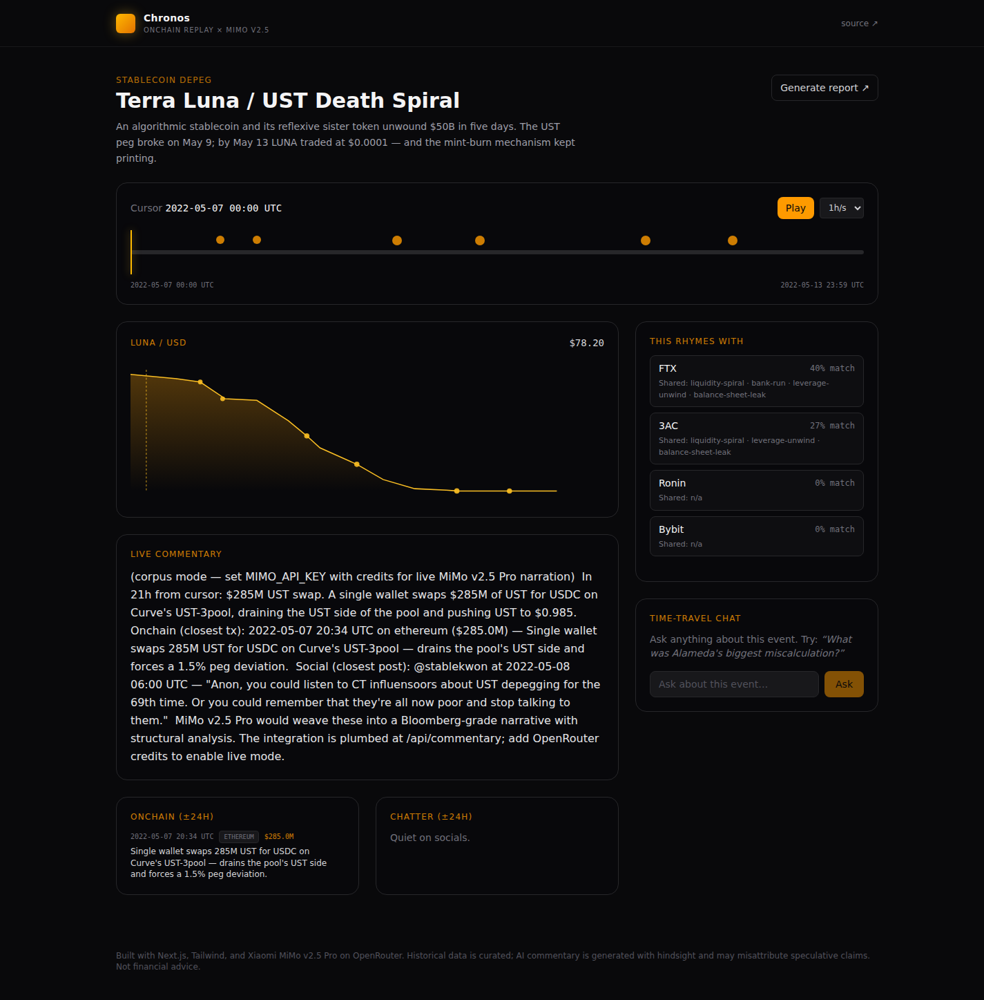

# Chronos

> Replay onchain history with an AI analyst beside you.
> Powered by **Xiaomi MiMo v2.5 Pro**.

🌐 **Live demo:** [chronos-onchain.vercel.app](https://chronos-onchain.vercel.app)



Scrub through five of the most consequential onchain events of the last
three years &mdash; FTX, Luna/UST, 3AC, Ronin, Bybit &mdash; minute by
minute. As you move the timeline cursor, MiMo v2.5 Pro narrates the moment
in real time, surfaces structural parallels with prior collapses, and
answers whatever you ask about it.

## What Chronos does

- **Time-aware replay** &mdash; every event has a curated timeline of price
  ticks, onchain transactions, and social posts. Scrub forward and the UI
  re-renders the world as it looked at that minute.
- **Live AI commentary** &mdash; MiMo v2.5 Pro reads a context window
  around the cursor and streams a Bloomberg-grade narrative via Server-Sent
  Events. The reasoning trace is exposed: you can see *why* MiMo flags an
  Alameda redemption as material before the market does.
- **Pattern matching** &mdash; pre-computed tag-overlap finds the closest
  prior events; MiMo then explains in prose why the resemblance is
  structural (not just superficial), and where the analogy breaks.
- **Time-travel chat** &mdash; ask anything about the cursor moment and
  MiMo answers grounded in the event corpus, with explicit "this is
  inference, not corpus" tags when it has to extrapolate.
- **One-click report** &mdash; auto-generated markdown post-mortem per
  event, structured like a Galaxy Research note.

## Why MiMo v2.5

Most LLMs can summarize an event after the fact. Chronos needs something
harder: read a corpus *as if you didn't know how it ended*, and surface
the cause-and-effect at the cursor.

- **MiMo v2.5 Pro** (`xiaomi/mimo-v2.5-pro`) handles narrative, pattern
  reasoning, and Q&A. The 1M-token context lets us drop the entire event
  corpus as input rather than retrieving fragments &mdash; the reasoning
  is grounded in everything that happened, not a guess.
- **MiMo v2.5** (`xiaomi/mimo-v2.5`, multimodal) is plumbed in for chart
  reading. Drop a CoinGecko screenshot or a Twitter thread image and MiMo
  reads price action and chatter together.

## Stack

- **Next.js 16** (App Router) + TypeScript + Tailwind CSS 4
- **MiMo v2.5 Pro & v2.5** via OpenRouter, OpenAI-compatible chat API
- **Server-Sent Events** for streaming commentary
- **Static event corpus** in `src/lib/events/*.ts` &mdash; price ticks,
  onchain tx summaries, social posts, timeline moments
- **Vercel** for deployment

## Local development

```bash
pnpm install
cp .env.example .env.local
# fill in MIMO_API_KEY (OpenRouter key with access to xiaomi/mimo-v2.5-pro)
pnpm dev
```

Open [http://localhost:3000](http://localhost:3000).

If `MIMO_API_KEY` is unset, the app falls back to deterministic mock
commentary so screenshots and previews still render.

## API surface

```
GET  /api/commentary?eventId=...&cursor=<unix-ms>   → SSE narrative stream
GET  /api/pattern?eventId=...                       → top-N similarity matches
GET  /api/pattern?eventId=...&matchId=...           → MiMo-generated comparison
POST /api/chat                                       → Q&A grounded in corpus
GET  /api/report?eventId=...                        → auto-generated markdown
```

## Curated events

| Event                | Date         | Loss        | Category              |
|----------------------|--------------|-------------|-----------------------|
| FTX Collapse         | Nov 2022     | ~$8B custody | exchange-collapse    |
| Terra Luna / UST     | May 2022     | ~$50B mcap   | stablecoin-depeg     |
| 3AC Blowup           | Jun 2022     | ~$3.5B claims| fund-blowup          |
| Ronin Bridge         | Mar 2022     | $625M        | bridge-hack          |
| Bybit Cold Wallet    | Feb 2025     | $1.46B       | exchange-hack        |

Adding new events: drop a `ChronosEvent` object into `src/lib/events/`
following the shape in `types.ts`, then re-export from `events.ts`.

## Roadmap

- [ ] MiMo v2.5 multimodal chart reading on hover
- [ ] Audio narration via TTS &mdash; "podcast mode"
- [ ] Live RPC fallback for events the curator hasn't indexed yet
- [ ] Embedding-based pattern matcher (replace tag jaccard)
- [ ] Per-event embeddable widget for crypto newsletters

## License

MIT.
